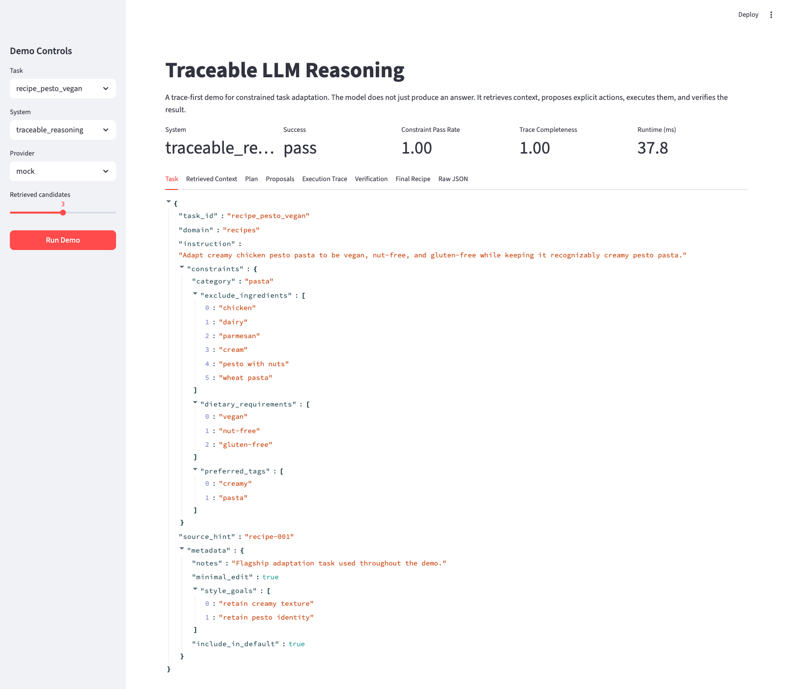
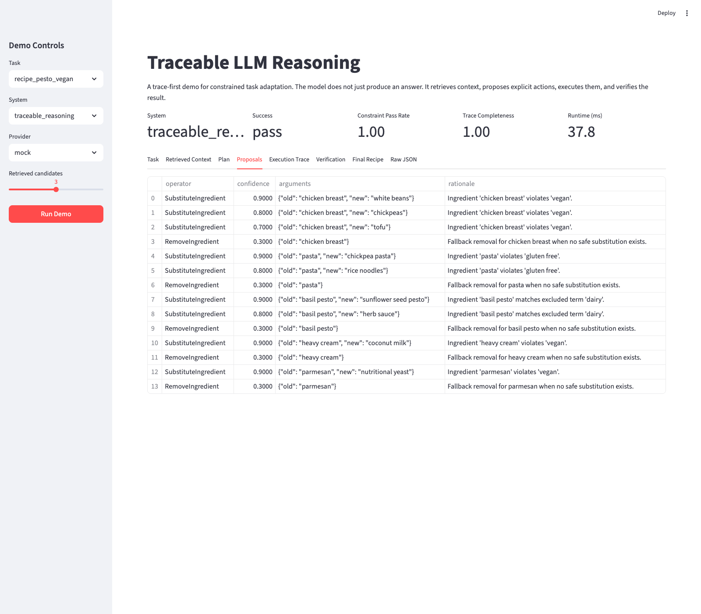
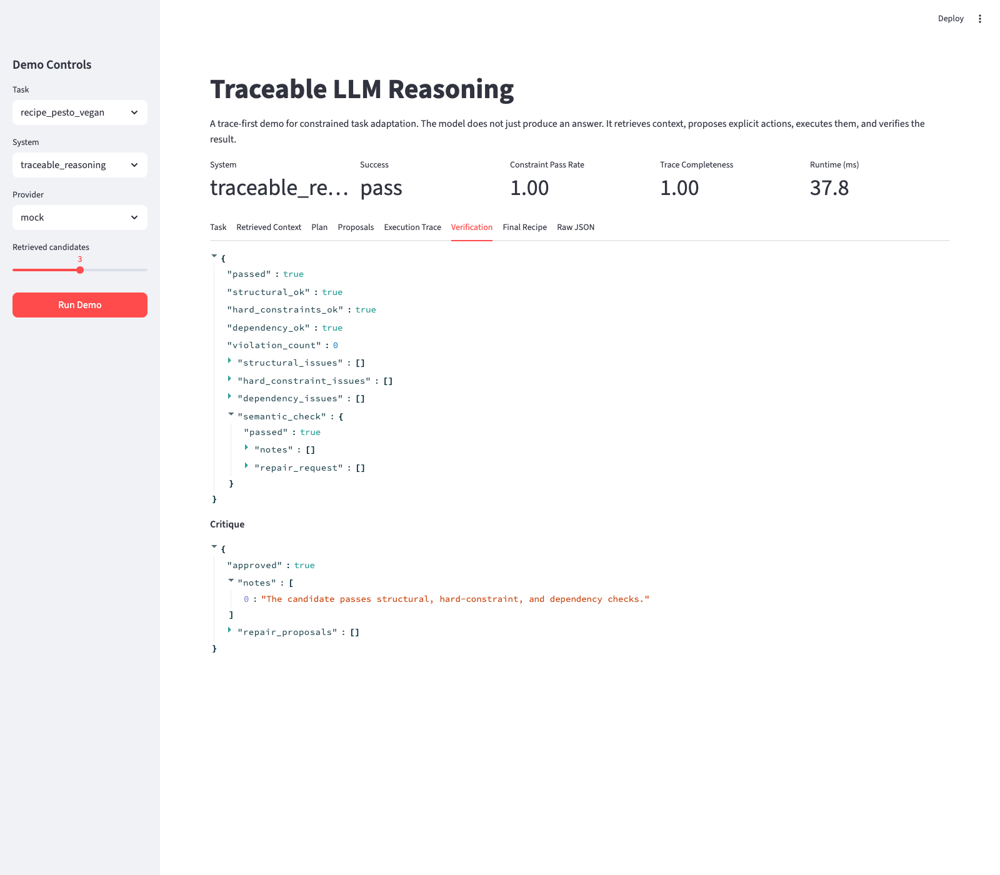
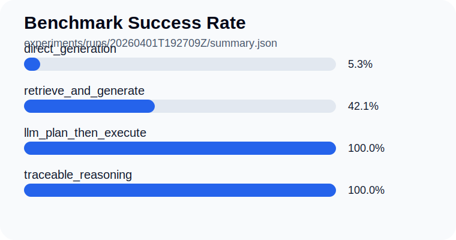

# Traceable LLM Reasoning

Traceable LLM Reasoning is a showcase project about making language models better at constrained tasks by combining retrieval, explicit action planning, search, and verification.

The first benchmark domain is recipe adaptation. Instead of asking a model to rewrite a recipe end to end in one shot, this project retrieves a relevant source recipe, proposes explicit edits, executes them as traceable actions, and verifies the result before returning it.

The benchmark now includes 24 curated tasks, including 5 contradictory or impossible cases used to test failure behavior.

## Why this project exists

Large language models are often strong at fluent text generation but weaker at:

- respecting hard constraints
- preserving structure during edits
- showing how a result was produced
- failing safely when a task is contradictory

This project turns that into a measurable benchmark:

- `direct_generation`
- `retrieve_and_generate`
- `llm_plan_then_execute`
- `traceable_reasoning`

The goal is to show that reasoning systems built around explicit traces outperform pure generation on constrained adaptation tasks.

## What the system does

For each task, the pipeline runs these stages:

1. retrieve candidate source recipes
2. build a structured reasoning plan from detected mismatches
3. propose explicit action primitives such as ingredient substitutions
4. execute those actions with beam search
5. verify structural, hard-constraint, dependency, and semantic consistency
6. return the final result together with a full reasoning trace

Current traceable actions:

- `SubstituteIngredient`
- `RemoveIngredient`
- `AddIngredient`
- `ReplaceAction`
- `AdjustParameter`
- `ReorderSteps`

## Architecture

```text
Task
  -> Retrieval
  -> Plan
  -> Operator Proposals
  -> Search / Execution
  -> Verification
  -> Critique
  -> Final Result + Trace
```

## Demo screenshots

Overview:



Action proposal trace:



Verification view:



## Flagship example

Task:

> Adapt creamy chicken pesto pasta to be vegan, nut-free, and gluten-free while keeping it recognizably creamy pesto pasta.

Source case:

- `recipe-001` `Creamy Chicken Pesto Pasta`

Successful action trace:

- `chicken breast -> white beans`
- `pasta -> chickpea pasta`
- `basil pesto -> sunflower seed pesto`
- `heavy cream -> coconut milk`
- `parmesan -> nutritional yeast`

Final output still passes:

- structural checks
- hard dietary constraints
- dependency checks
- semantic review

## Repo layout

```text
traceable_llm_reasoning/
  benchmarks/recipes/   recipe benchmark, fixtures, retrieval, operators, verification
  providers/            mock, Ollama, and OpenAI-compatible provider paths
  reasoning/            plan, proposals, executor, critique, trace types
  cli.py                benchmark and demo entrypoint
experiments/configs/    benchmark configs
tests/                  smoke tests
```

## Quick start

Install:

```bash
pip install -e .
```

Run the flagship demo:

```bash
python -m traceable_llm_reasoning.cli demo --task recipe_pesto_vegan --system traceable_reasoning --provider mock
```

Run the default benchmark:

```bash
python -m traceable_llm_reasoning.cli benchmark --config experiments/configs/default.json
```

Run the trace explorer:

```bash
streamlit run apps/streamlit/app.py
```

## Current benchmark result



Latest default benchmark run:

- default suite size: `19` tasks
- `direct_generation`: success rate `0.0526`
- `retrieve_and_generate`: success rate `0.4211`
- `llm_plan_then_execute`: success rate `1.0`
- `traceable_reasoning`: success rate `1.0`

Verifier benchmark:

- precision `1.0`
- recall `1.0`
- detection rate `1.0`

This is the behavior the project is aiming to show:

- pure generation is weakest
- retrieval helps
- planning plus execution helps more
- the full traced pipeline is strongest and most inspectable

## Providers

Default local development uses the deterministic `mock` provider so the benchmark stays reproducible.

Optional provider modes:

- `mock`
- `rule-based`
- `ollama`
- `openai-compatible`

Environment variables:

- `TLR_PROVIDER_MODE`
- `TLR_OLLAMA_HOST`
- `TLR_OLLAMA_MODEL`
- `TLR_OPENAI_BASE_URL`
- `TLR_OPENAI_API_KEY`
- `TLR_OPENAI_MODEL`

## What is implemented today

- benchmark fixtures and runnable recipe tasks
- retrieval with optional reranking
- provider-backed structured planning and operator proposals
- symbolic execution with beam search and greedy rescue
- provider-backed critique and multi-stage verification
- Streamlit trace explorer for the flagship benchmark
- JSON experiment outputs under `experiments/runs/`
- runnable CLI and smoke tests
- benchmark visualization script in `scripts/render_summary_svg.py`

## Roadmap

- larger benchmark with more constrained tasks and impossible cases
- Streamlit trace explorer
- screenshots and GIFs in this README
- stronger live-model provider integrations
- plots and ablations for reasoning vs. generation
